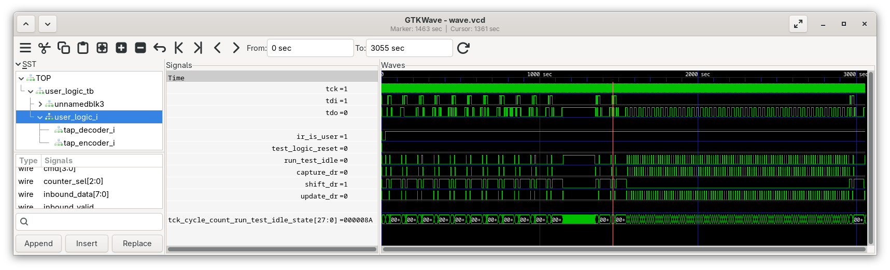

Simple simulation and synthesis design showing non-expected behavior in Vivado of the `run_state_hw_jtag -state IDLE IDLE` command.

# Problem Description

Vivado provides the `run_state_hw_jtag` command which is described by ug835 as following:

> Transition the hw_jtag object of the current hardware target to the specified TAP stable state.
> 
> (...)
> 
> If an optional -state path list is defined, then the state list must contain all states needed to reach the stable state, or the command will return an error. If no state path list is defined, then the command will transition from the current state to the target state according to the state transition paths defined in the following table: 
> 
> | Current | Target | State Transition Path |
> | ------- | ------ | --------------------- |
> | (...)   | (...)  | (...)                 |
> | IDLE    | IDLE   | IDLE                  |
> | (...)   | (...)  | (...)                 |

Assuming someone has [a pipelined design clocked by `tck`](https://github.com/MatthieuMichon/aoc-rtl/tree/main/25/4) and wants to generate a number of `tck` clock cycles for flushing data out of said pipeline. Reading the command description above, he may think that the `tck` clock could be toggled simply by running `run_state_hw_jtag -state IDLE IDLE`.

In practice, on Vivado 2025.2 on a Zynq-7 device this command **does not behave as expected**, instead and simply **does nothing**.

The table below summarizes expected vs actual behavior of different commands:

| Design Implementation                                       | Expected | Simulation | Board-run | 
| ----------------------------------------------------------- | -------- | ---------- | --------- |
| Simple `TCK_CYCLE_COUNT_RUN_TEST_IDLE_STATE` delta          | 3        | ✅ 3       | ✅ 3      |
| 100x `run_state_hw_jtag -state IDLE IDLE`                   | 103      | (1) ✅ 103  | ❌ 3      |
| 100x `run_state_hw_jtag IDLE`                               | 103      | (1) ✅ 103  | ✅ 103    |
| 100x `run_state_hw_jtag DRPAUSE` + `run_state_hw_jtag IDLE` | 103      | ✅ 103     | ✅ 103    |

(1) Both implementations are identical from the simulation perspective.

# Getting Started

Software vesions:

- Vivado 2025.2 (Linux)
- Verilator 5.034

## Synthesis + On-board Execution

```
make synth
```

Result:

```
TAP run-test-idle tck count: 148496 (0x40024410)
TAP run-test-idle tck count: 148499 (0x40024410)
Difference: 3
TAP run-test-idle tck count: 148502 (0x40024416)
TAP run-test-idle tck count: 148505 (0x40024416)
Difference after 100x `run_state_hw_jtag -state IDLE IDLE`: 3
TAP run-test-idle tck count: 148508 (0x4002441c)
TAP run-test-idle tck count: 148611 (0x4002441c)
Difference after 100x `run_state_hw_jtag IDLE`: 103
TAP run-test-idle tck count: 148614 (0x40024486)
TAP run-test-idle tck count: 148717 (0x40024486)
Difference after 100x `run_state_hw_jtag DRPAUSE` + `run_state_hw_jtag IDLE`: 103
```

## Simulation

```
make sim
```

Result:

```
TAP run-test-idle tck count:        27 (0x4000001b)
TAP run-test-idle tck count:        30 (0x4000001e)
Difference:         3
TAP run-test-idle tck count:        33 (0x40000021)
TAP run-test-idle tck count:       136 (0x40000088)
Difference after 100x `run_state_hw_jtag(RUN_TEST_IDLE)`:       103
TAP run-test-idle tck count:       139 (0x4000008b)
TAP run-test-idle tck count:       242 (0x400000f2)
Difference after 100x `run_state_hw_jtag(PAUSE_DR -> RUN_TEST_IDLE)`:       103
```


